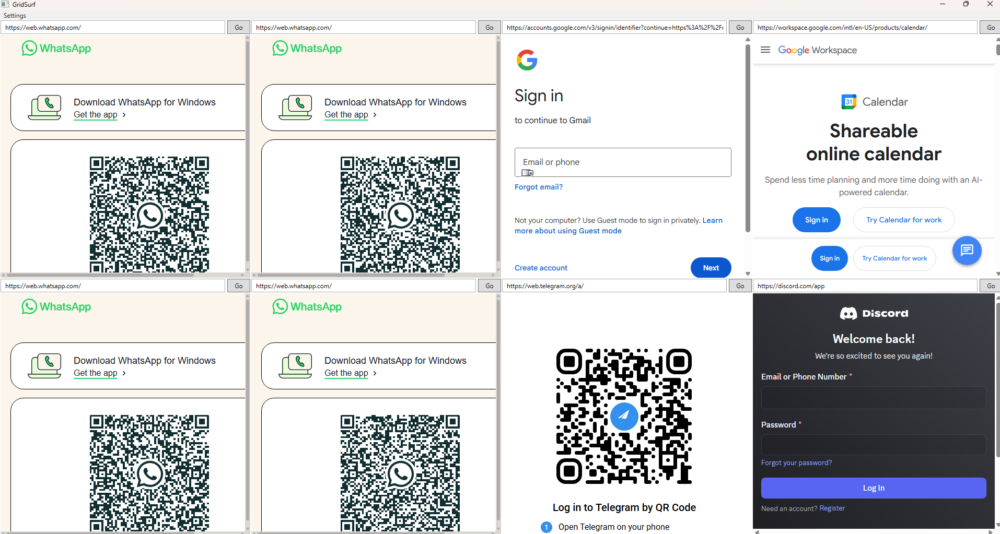

# GridSurf

Run up to **8 independent WhatsApp Web sessions** side by side in one lightweight desktop window.

No Electron. No bundled Chromium. Just your system's Edge WebView2 runtime — already installed on Windows 10/11.




## Why GridSurf?

| Problem | GridSurf |
|---------|----------|
| WhatsApp Desktop only supports 1 account | Up to 8 accounts simultaneously |
| Electron-based alternatives eat 2-4GB RAM | ~50-60% lighter via shared Chromium processes |
| Browser tabs share cookies — can't multi-login | Each pane runs an isolated WebView2 profile |
| Opening multiple browser profiles is clunky | One window, clean grid layout, done |

## Features

- **8 independent sessions** — each pane has its own cookies, localStorage, IndexedDB. Log into 8 different WhatsApp accounts
- **Shared Chromium engine** — one WebView2 environment with named profiles per pane. Browser, GPU and network processes are shared; only the renderer is per-pane
- **Renderer suspension** — hidden panes call `TrySuspendAsync()` so the OS reclaims their memory; visible again → instant resume, no QR re-scan
- **Lightweight** — uses system Edge WebView2 runtime (already on your PC). No bundled browser engine
- **Persistent login** — close the app, reopen it, you're still logged in
- **Flexible layout** — choose 1 to 8 panes. Grid auto-adjusts (1, 2 side-by-side, 2x2, 3+2, 4+4, etc.)
- **URL bar per pane** — not just WhatsApp. Load any website in any pane (Gmail, Telegram, Discord, etc.)
- **Auto-granted permissions** — notifications, clipboard paste, file downloads all work out of the box
- **Crash recovery** — if a renderer crashes, the pane auto-reloads; if a resumed pane shows "Computer not connected", it auto-refreshes
- **Settings preserved** — saving Settings does not reload panes whose URL hasn't changed (chat scroll/draft preserved)
- **Zero telemetry** — no tracking, no analytics, no phoning home. Your data stays on your machine

## Download

### Option 1: Download the release (recommended)

Go to [Releases](../../releases) and download the latest `GridSurf.zip`. Extract and run `GridSurf.exe`.

**Requirements:**
- Windows 10/11
- [.NET 8 Desktop Runtime](https://dotnet.microsoft.com/download/dotnet/8.0) (if not already installed)
- Edge WebView2 Runtime (pre-installed on Windows 10/11)

### Option 2: Build from source

**Prerequisites:**
- [.NET 8 SDK](https://dotnet.microsoft.com/download/dotnet/8.0) (not just runtime — you need the SDK to build)
- Git

```bash
git clone https://github.com/user/GridSurf.git
cd GridSurf
dotnet restore
dotnet build -c Release
```

**Publish as standalone exe:**
```bash
dotnet publish -c Release -r win-x64 --self-contained true -o publish
```

Run it:

```bash
bin\Release\net8.0-windows\GridSurf.exe
```

## Usage

1. Launch GridSurf
2. Two WhatsApp Web panes appear side by side
3. Scan QR code in each pane with a different phone
4. Done — two WhatsApp accounts in one window

### Settings (Ctrl + ,)

- Change URLs for any pane (WhatsApp, Gmail, Telegram, Discord, etc.)
- Set visible pane count (1–8)
- Unused panes are suspended — zero RAM wasted

## How it works

GridSurf uses a **single shared [WebView2](https://developer.microsoft.com/en-us/microsoft-edge/webview2/) environment** with one [named profile](https://learn.microsoft.com/en-us/microsoft-edge/webview2/concepts/multi-profile-support) per pane (`WA1`..`WA8`). All panes share one browser process, one GPU process, one network process — but each profile keeps its own cookies, IndexedDB, localStorage and service workers, so logins stay fully independent.

```
~/.gridsurf/
├── settings.json
└── webview2/
    └── EBWebView/
        └── Profiles/
            ├── WA1/    # Pane 1 cookies, storage, cache
            ├── WA2/    # Pane 2 cookies, storage, cache
            ├── ...
            └── WA8/    # Pane 8 cookies, storage, cache
```

**v1.0** used a separate WebView2 environment per pane → full Chromium process tree per session → 5-7 GB for 8 panes.
**v1.1** switched to multi-profile (one shared environment, isolated profiles) → ~3.5 GB for 8 panes.
**v1.2** adds renderer suspension via `TrySuspendAsync` → hidden panes' renderers are paged out → ~1.9 GB when only 2 of 8 panes are visible.

## Memory usage

Real measurements on Windows 11, 8 WhatsApp Web sessions logged in:

| State | v1.0 | v1.1 | **v1.2** |
|---|---|---|---|
| 8 panes all visible | ~5.5-7 GB | ~3.5 GB | **~3.0 GB** |
| 8 loaded, 2 visible (6 suspended) | N/A | N/A | **~1.9 GB** ✓ measured |
| 2 panes only | ~1.3 GB | ~1.45 GB | **~1.4 GB** |

For comparison: 8 services on Ferdium/Rambox (Electron) typically use 2-4 GB; Beeper (native, no Chromium) sits around 200 MB but has zero web parity. WhatsApp Desktop's official UWP app uses ~600 MB for **one** account.

### How suspension works

When you reduce the visible pane count in Settings, hidden panes are kept logged in but their JS execution is paused via `CoreWebView2.TrySuspendAsync()`. The OS then pages out their working set. When you make them visible again, `Resume()` rehydrates them — WhatsApp's WebSocket reconnects in 1-3 seconds, no QR re-scan needed.

Settings dialog (Ctrl+,) is your control panel: bump pane count up to bring sessions back, drop it to free RAM.

## Upgrading from v1.0 / v1.1

On first launch, GridSurf v1.2 will:

1. Detect any old `session1`..`session8` folders under `~/.gridsurf/`
2. Show a one-time upgrade prompt
3. Move them into `~/.gridsurf/legacy-sessions-backup/`
4. Initialize the new shared profile layout

If you already had v1.1 sessions in `~/.gridsurf/webview2/`, they continue to work as-is — no re-scan needed.

If you're coming from v1.0, your old session data is preserved in the backup folder. You can manually copy each `legacy-sessions-backup/sessionN/EBWebView/Default/` into `~/.gridsurf/webview2/EBWebView/WV2Profile_waN/` to keep your logins; otherwise re-scan the QR once per pane.

## Tech stack

- **C# / .NET 8** — WPF desktop app
- **Microsoft WebView2** — Edge-based web rendering (uses system runtime, not bundled)
- **Zero dependencies** beyond WebView2 NuGet package

## Project structure

```
GridSurf/
├── App.xaml / App.xaml.cs           # Application entry
├── MainWindow.xaml / .xaml.cs       # Main window, pane grid, WebView2 lifecycle
├── SettingsStore.cs                 # Load/save settings, session migration
├── SettingsWindow.xaml / .xaml.cs   # Settings dialog
├── GridSurf.csproj                 # Project file
├── build.bat / build.ps1           # Build scripts
└── .gitignore
```

## Contributing

Found a bug? Want a feature? Open an issue or PR.

This was built to scratch my own itch — running multiple WhatsApp accounts without bloated apps eating my RAM. If it helps you too, that's a win.

## License

[MIT](LICENSE) — do whatever you want with it.
